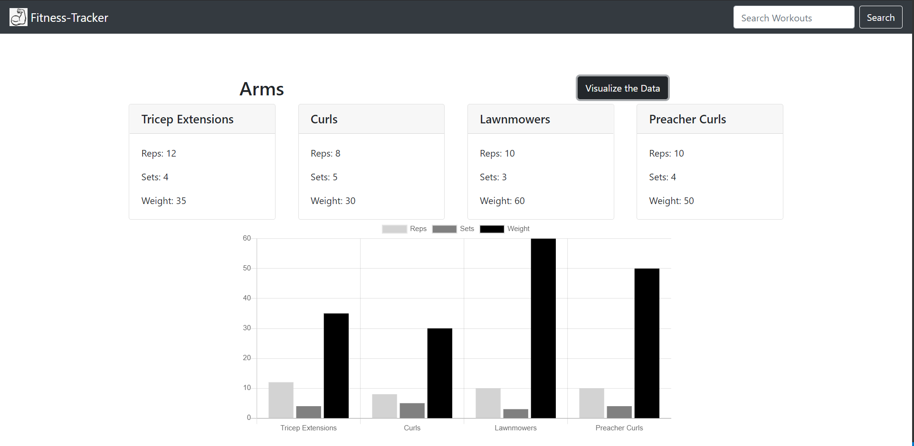

# Fitness-Tracker

This is the Fitness-Tracker web application. Enter a workout that you have completed along with all the excersizes in your workout and add it to the site. The Fitness-Tracker will store and render your workout data when you click on a specific workout that has already been entered. The app also has built in data visualization features to break down your workout into easy to understand visual charts. It will help you visualize your rep to set ratio for resistance workouts as well rest vs workout time for cardio workouts. This way you can make more informed decisions on ways to change your workout to maximize your fitness goals. This app utilizes handlebars to render each page. The Fitness-Tracker uses MongoDB to store all the workouts. Give it a try and add your workout to the Fitness-Tracker here: 

